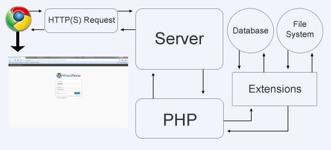

# Interview Creation Portal 
Create a simple app where admins can create interviews by selecting participants, interview start time and end time

### Deployed here: https://interviewly.000webhostapp.com

Tech Stack used:-<br>
```diff
- Frontend :- HTML,CSS,BOOTSTRAP,JS 
+ Backend :- PHP 
! Database :- MySql 
```
<br>

## Basic Requirements
* An interview creation page where the admin can create an interview by selecting participants, start time and end time. Backend should throw error with proper error message if: 
  * Any of the participants is not available during the scheduled time (i.e, has another interview scheduled)
  * No of participants is less than 2
* An interviews list page where admin can see all the upcoming interviews.
* Note: No need to add a page to create Users/Participants. Create them directly in the database

## Good To Haves
* Option to add resume link of candidates which can be seen by admin later.

## How Php Works:


## Upcoming Updates
* Admin Authentication page 
* Send Emails to participants on interview creation.
* Add option to add participant's Image.


## How to build and run this project

* Clone this repository.
* Execute it in localhost/WebServer.
* Make sure MySQL is installed your system.
* Login to MySQL using your root user.
* Execute the following MySQL Queries:
  * `CREATE USER 'username'@'localhost' IDENTIFIED WITH mysql_native_password BY 'password';`
  * `GRANT ALL PRIVILEGES ON DB_NAME.* TO 'username'@'localhost';`
  * `FLUSH PRIVILEGES;`
  * `exit`
* For now 
  * Admin Username :- 'root'
  * password :- '123'
* Provide `username`, `password` and `database` (DB_NAME) info in **connect.php** for authenticate and properly connect to the Database.
* Execute `index.php`.

## Project Directory Structure

```
   .
   .
   root
   ├──Images
   │    ├── logo.png
   │    ├── php_works.png
   │    └── img.svg
   │  
   ├── src
   │   │ 
   │   ├── pages
   │   │   ├── editInterviews.php
   │   │   ├── upcomingInterviews.php
   │   │   └── user.php
   │   │ 
   │   └── crud
   │       ├── connect.php
   │       ├── delete.php
   │       └── update.php
   │   
   ├── index.php
   ├── style.css
   └── README.md
```


### License

```
MIT License

Copyright (c) 2022 Jaskaran Singh

Permission is hereby granted, free of charge, to any person obtaining a copy
of this software and associated documentation files (the "Software"), to deal
in the Software without restriction, including without limitation the rights
to use, copy, modify, merge, publish, distribute, sublicense, and/or sell
copies of the Software, and to permit persons to whom the Software is
furnished to do so, subject to the following conditions:

The above copyright notice and this permission notice shall be included in all
copies or substantial portions of the Software.

THE SOFTWARE IS PROVIDED "AS IS", WITHOUT WARRANTY OF ANY KIND, EXPRESS OR
IMPLIED, INCLUDING BUT NOT LIMITED TO THE WARRANTIES OF MERCHANTABILITY,
FITNESS FOR A PARTICULAR PURPOSE AND NONINFRINGEMENT. IN NO EVENT SHALL THE
AUTHORS OR COPYRIGHT HOLDERS BE LIABLE FOR ANY CLAIM, DAMAGES OR OTHER
LIABILITY, WHETHER IN AN ACTION OF CONTRACT, TORT OR OTHERWISE, ARISING FROM,
OUT OF OR IN CONNECTION WITH THE SOFTWARE OR THE USE OR OTHER DEALINGS IN THE
SOFTWARE.
```
